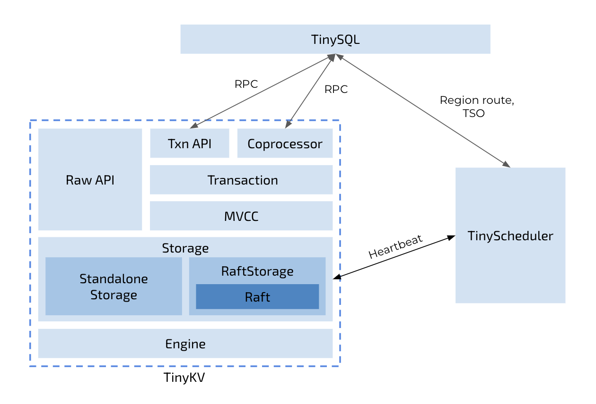

# TinyKV 课程

TinyKV 课程使用 Raft 共识算法构建一个键值存储系统。它受到 [MIT 6.824](https://pdos.csail.mit.edu/6.824/) 和 [TiKV 项目](https://github.com/tikv/tikv) 的启发。

完成本课程后，你将掌握实现一个水平可扩展、高可用、支持分布式事务的键值存储服务的知识。同时，你将对 TiKV 的架构和实现有更好的理解。

## 课程架构

整个项目开始时是一个键值服务器和调度器服务器的骨架代码——你需要逐步完成核心逻辑：

* [单机 KV](doc/project1-StandaloneKV.md)
  * 实现一个单机存储引擎。
  * 实现原始键值服务处理器。
* [Raft KV](doc/project2-RaftKV.md)
  * 实现基本的 Raft 算法。
  * 在 Raft 之上构建容错 KV 服务器。
  * 添加 Raft 日志垃圾回收和快照支持。
* [Multi-raft KV](doc/project3-MultiRaftKV.md)
  * 为 Raft 算法实现成员变更和领导权转移。
  * 在 Raft store 上实现配置变更和 Region 分裂。
  * 实现一个基本的调度器。
* [事务](doc/project4-Transaction.md)
  * 实现多版本并发控制层。
  * 实现 `KvGet`、`KvPrewrite` 和 `KvCommit` 请求的处理器。
  * 实现 `KvScan`、`KvCheckTxnStatus`、`KvBatchRollback` 和 `KvResolveLock` 请求的处理器。

## 代码结构



类似于 TiDB + TiKV + PD 将存储和计算分离的架构，TinyKV 只关注分布式数据库系统的存储层。如果你对 SQL 层也感兴趣，请参阅 [TinySQL](https://github.com/tidb-incubator/tinysql)。除此之外，还有一个名为 TinyScheduler 的组件作为整个 TinyKV 集群的中心控制，它从 TinyKV 的心跳中收集信息。之后，TinyScheduler 可以生成调度任务并将任务分发给 TinyKV 实例。所有实例之间通过 RPC 进行通信。

整个项目组织为以下目录：

* `kv` 包含键值存储的实现。
* `raft` 包含 Raft 共识算法的实现。
* `scheduler` 包含 TinyScheduler 的实现，它负责管理 TinyKV 节点和生成时间戳。
* `proto` 包含节点和进程之间所有使用 Protocol Buffers over gRPC 的通信实现。这个包包含 TinyKV 使用的协议定义，以及你可以使用的生成的 Go 代码。
* `log` 包含基于级别输出日志的工具。

## 推荐阅读列表

我们提供了一个关于分布式存储系统知识的[推荐阅读列表](doc/reading_list.md)。虽然并非所有内容都与本课程高度相关，但它们可以帮助你在这个领域构建知识体系。

同时，我们鼓励你阅读 TiKV 和 PD 设计的概述，以对你将要构建的内容有一个总体印象：

* TiKV，数据存储的设计（[英文](https://en.pingcap.com/blog/tidb-internal-data-storage)，[中文](https://pingcap.com/zh/blog/tidb-internal-1)）。
* PD，调度的设计（[英文](https://en.pingcap.com/blog/tidb-internal-scheduling)，[中文](https://pingcap.com/zh/blog/tidb-internal-3)）。

## 从源码构建 TinyKV

### 前置条件

* `git`：TinyKV 的源代码托管在 GitHub 上作为 git 仓库。要使用 git 仓库，请[安装 `git`](https://git-scm.com/downloads)。
* `go`：TinyKV 是一个 Go 项目。要从源码构建 TinyKV，请[安装 `go`](https://golang.org/doc/install)，版本需要大于或等于 1.13。

### 克隆

将源代码克隆到你的开发机器。

```bash
git clone https://github.com/tidb-incubator/tinykv.git
```

### 构建

从源代码构建 TinyKV。

```bash
cd tinykv
make
```

它将 `tinykv-server` 和 `tinyscheduler-server` 的二进制文件构建到 `bin` 目录。

## 与 TinySQL 一起运行 TinyKV

1. 按照[其文档](https://github.com/tidb-incubator/tinysql#deploy)获取 `tinysql-server`。
2. 将 `tinyscheduler-server`、`tinykv-server` 和 `tinysql-server` 的二进制文件放到同一个目录。
3. 在二进制文件目录下，运行以下命令：

```bash
mkdir -p data
./tinyscheduler-server
./tinykv-server -path=data
./tinysql-server --store=tikv --path="127.0.0.1:2379"
```

现在你可以用官方 MySQL 客户端连接到数据库：

```bash
mysql -u root -h 127.0.0.1 -P 4000
```

## 自动评分和认证

自 2022 年 6 月起，我们开始使用 [github classroom](https://github.com/talent-plan/tinysql/blob/course/classroom.md) 来接受实验并及时提供自动评分。GitHub classroom 邀请链接是 https://classroom.github.com/a/cdlNNrFU。讨论微信/Slack 群和通过课程后的认证在 [tinyKV 学习课程](https://talentplan.edu.pingcap.com/catalog/info/id:263) 中提供。

自动评分是一个可以自动运行测试用例并及时反馈的工作流。然而 Github classroom 有一些限制，为了使 golang 工作并在我们的自托管机器上运行，**你需要覆盖 Github classroom 生成的工作流并提交它**。

```sh
cp scripts/classroom.yml .github/workflows/classroom.yml
git add .github
git commit -m"update github classroom workflow"
```

## 贡献

任何反馈和贡献都非常感谢。如果你想参与开发，请查看 [issues](https://github.com/tidb-incubator/tinykv/issues)。
