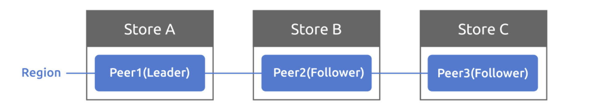

# 项目2 RaftKV

Raft 是一种设计为易于理解的共识算法。你可以在 [Raft 网站](https://raft.github.io/) 阅读有关 Raft 本身的材料、Raft 的交互式可视化以及其他资源，包括[扩展版 Raft 论文](https://raft.github.io/raft.pdf)。

在本项目中，你将实现一个基于 Raft 的高可用键值服务器，这不仅需要你实现 Raft 算法，还需要实际使用它，并带来更多挑战，如使用 `badger` 管理 Raft 的持久化状态、为快照消息添加流量控制等。

该项目有3个部分需要完成：

- 实现基本的 Raft 算法
- 在 Raft 之上构建容错键值服务器
- 添加 Raft 日志 GC 和快照支持

## Part A

### 代码结构

在这部分，你将实现基本的 Raft 算法。你需要实现的代码在 `raft/` 目录下。`raft/` 中有一些框架代码和测试用例等待你完成。你要实现的 Raft 算法与上层应用有一个设计良好的接口。此外，它使用逻辑时钟（这里称为 tick）来测量选举和心跳超时，而不是物理时钟。也就是说，不要在 Raft 模块本身中设置计时器，上层应用负责通过调用 `RawNode.Tick()` 来推进逻辑时钟。除此之外，消息的发送和接收以及其他事情都是异步处理的，何时实际执行这些事情也取决于上层应用（详见下文）。例如，Raft 不会阻塞等待任何请求消息的响应。

在实现之前，请先查看本部分末尾的提示。另外，你应该粗略地看一下 proto 文件 `proto/proto/eraftpb.proto`。Raft 发送和接收消息以及相关的结构体都在那里定义，你将在实现中使用它们。注意，与 Raft 论文不同，它将 Heartbeat 和 AppendEntries 分成不同的消息，使逻辑更清晰。

这部分可以分为3个步骤：

- 领导者选举
- 日志复制
- Raw node 接口

### 实现 Raft 算法

`raft/raft.go` 中的 `raft.Raft` 提供了 Raft 算法的核心，包括消息处理、驱动逻辑时钟等。有关更多实现指南，请查看 `raft/doc.go`，其中包含概述设计以及这些 `MessageTypes` 的职责。

#### 领导者选举

要实现领导者选举，你可能想从 `raft.Raft.tick()` 开始，它用于将内部逻辑时钟推进一个 tick，从而驱动选举超时或心跳超时。你现在不需要关心消息发送和接收的逻辑。如果你需要发送消息，只需将其推送到 `raft.Raft.msgs`，Raft 收到的所有消息都将传递给 `raft.Raft.Step()`。测试代码将从 `raft.Raft.msgs` 获取消息，并通过 `raft.Raft.Step()` 传递响应消息。`raft.Raft.Step()` 是消息处理的入口，你应该处理像 `MsgRequestVote`、`MsgHeartbeat` 及其响应这样的消息。同时请实现测试桩函数并正确调用它们，如 `raft.Raft.becomeXXX`，它用于在 Raft 角色改变时更新 Raft 内部状态。

你可以运行 `make project2aa` 来测试实现，并在本部分末尾查看一些提示。

#### 日志复制

要实现日志复制，你可能想从在发送方和接收方两侧处理 `MsgAppend` 和 `MsgAppendResponse` 开始。查看 `raft/log.go` 中的 `raft.RaftLog`，它是一个帮助你管理 Raft 日志的辅助结构体，在这里你还需要通过 `raft/storage.go` 中定义的 `Storage` 接口与上层应用交互，以获取持久化的数据，如日志条目和快照。

你可以运行 `make project2ab` 来测试实现，并在本部分末尾查看一些提示。

### 实现 raw node 接口

`raft/rawnode.go` 中的 `raft.RawNode` 是我们与上层应用交互的接口，`raft.RawNode` 包含 `raft.Raft` 并提供一些包装函数，如 `RawNode.Tick()` 和 `RawNode.Step()`。它还提供 `RawNode.Propose()` 让上层应用提议新的 Raft 日志。

另一个重要的结构体 `Ready` 也在这里定义。在处理消息或推进逻辑时钟时，`raft.Raft` 可能需要与上层应用交互，例如：

- 向其他对等节点发送消息
- 将日志条目保存到稳定存储
- 将硬状态（如任期、提交索引和投票）保存到稳定存储
- 将已提交的日志条目应用到状态机
- 等等

但这些交互不会立即发生，而是被封装在 `Ready` 中并通过 `RawNode.Ready()` 返回给上层应用。何时调用 `RawNode.Ready()` 以及如何处理它取决于上层应用。在处理完返回的 `Ready` 后，上层应用还需要调用一些函数，如 `RawNode.Advance()` 来更新 `raft.Raft` 的内部状态，如已应用的索引、已稳定的日志索引等。

你可以运行 `make project2ac` 来测试实现，运行 `make project2a` 来测试整个 Part A。

> 提示：
>
> - 向 `raft.Raft`、`raft.RaftLog`、`raft.RawNode` 添加任何你需要的状态，以及 `eraftpb.proto` 中的消息
> - 测试假设首次启动 Raft 时任期应该是 0
> - 测试假设新当选的领导者应该在其任期内追加一个空操作条目
> - 测试假设一旦领导者推进其提交索引，它将通过 `MessageType_MsgAppend` 消息广播提交索引
> - 测试不会为本地消息设置任期，如 `MessageType_MsgHup`、`MessageType_MsgBeat` 和 `MessageType_MsgPropose`
> - 领导者和非领导者的日志条目追加相当不同，有不同的来源、检查和处理，要小心
> - 不要忘记选举超时在不同对等节点之间应该是不同的
> - `rawnode.go` 中的一些包装函数可以通过 `raft.Step(local message)` 实现
> - 启动新的 Raft 时，从 `Storage` 获取最后的稳定状态来初始化 `raft.Raft` 和 `raft.RaftLog`

## Part B

在这部分，你将使用 Part A 中实现的 Raft 模块构建一个容错的键值存储服务。你的键值服务将是一个复制状态机，由多个使用 Raft 进行复制的键值服务器组成。只要大多数服务器存活并且可以通信，你的键值服务就应该继续处理客户端请求，尽管存在其他故障或网络分区。

在项目1中你已经实现了一个单机键值服务器，所以你应该已经熟悉键值服务器 API 和 `Storage` 接口。

在介绍代码之前，你需要首先了解三个术语：`Store`、`Peer` 和 `Region`，它们在 `proto/proto/metapb.proto` 中定义。

- Store 代表一个 tinykv-server 实例
- Peer 代表一个运行在 Store 上的 Raft 节点
- Region 是一组 Peer 的集合，也称为 Raft 组



为简单起见，在项目2中一个 Store 上只有一个 Peer，集群中只有一个 Region。所以你现在不需要考虑 Region 的范围。多个 Region 将在项目3中进一步介绍。

### 代码结构

首先，你应该看一下 `kv/storage/raft_storage/raft_server.go` 中的 `RaftStorage`，它也实现了 `Storage` 接口。与直接写入或读取底层引擎的 `StandaloneStorage` 不同，它首先将每个写入和读取请求发送到 Raft，然后在 Raft 提交请求后才对底层引擎进行实际的写入和读取。通过这种方式，它可以保持多个 Store 之间的一致性。

`RaftStorage` 创建一个 `Raftstore` 来驱动 Raft。当调用 `Reader` 或 `Write` 函数时，它实际上通过通道（通道是 `raftWorker` 的 `raftCh`）向 raftstore 发送一个 `proto/proto/raft_cmdpb.proto` 中定义的 `RaftCmdRequest`，其中包含四种基本命令类型（Get/Put/Delete/Snap），并在 Raft 提交和应用命令后返回响应。`Reader` 和 `Write` 函数的 `kvrpc.Context` 参数现在有用了，它从客户端的角度携带 Region 信息，并作为 `RaftCmdRequest` 的头部传递。该信息可能不正确或过时，因此 raftstore 需要检查它们并决定是否提议请求。

然后，来到 TinyKV 的核心——raftstore。结构有点复杂，阅读 TiKV 参考资料以更好地理解设计：

- <https://pingcap.com/blog-cn/the-design-and-implementation-of-multi-raft/#raftstore>（中文版）
- <https://pingcap.com/blog/design-and-implementation-of-multi-raft/#raftstore>（英文版）

raftstore 的入口是 `Raftstore`，见 `kv/raftstore/raftstore.go`。它启动一些工作线程来异步处理特定任务，其中大多数现在不使用，所以你可以忽略它们。你只需要关注 `raftWorker`。（kv/raftstore/raft_worker.go）

整个过程分为两部分：raft worker 轮询 `raftCh` 以获取消息，包括驱动 Raft 模块的基本 tick 和要作为 Raft 条目提议的 Raft 命令；它从 Raft 模块获取并处理 ready，包括发送 Raft 消息、持久化状态、将已提交的条目应用到状态机。一旦应用完成，将响应返回给客户端。

### 实现 peer storage

Peer storage 是你在 Part A 中通过 `Storage` 接口交互的内容，但除了 Raft 日志之外，peer storage 还管理其他持久化的元数据，这对于在重启后恢复一致的状态机非常重要。此外，在 `proto/proto/raft_serverpb.proto` 中定义了三个重要的状态：

- RaftLocalState：用于存储当前 Raft 的 HardState 和最后的日志索引。
- RaftApplyState：用于存储 Raft 应用的最后日志索引和一些截断的日志信息。
- RegionLocalState：用于存储 Region 信息和该 Store 上对应的 Peer 状态。Normal 表示该 Peer 正常，Tombstone 表示该 Peer 已从 Region 中移除，不能加入 Raft 组。

这些状态存储在两个 badger 实例中：raftdb 和 kvdb：

- raftdb 存储 Raft 日志和 `RaftLocalState`
- kvdb 存储不同列族中的键值数据、`RegionLocalState` 和 `RaftApplyState`。你可以将 kvdb 视为 Raft 论文中提到的状态机

格式如下，`kv/raftstore/meta` 中提供了一些辅助函数，并使用 `writebatch.SetMeta()` 将它们设置到 badger。

| 键              | 键格式                            | 值               | 数据库 |
| :-------------- | :------------------------------- | :--------------- | :----- |
| raft_log_key    | 0x01 0x02 region_id 0x01 log_idx | Entry            | raft   |
| raft_state_key  | 0x01 0x02 region_id 0x02         | RaftLocalState   | raft   |
| apply_state_key | 0x01 0x02 region_id 0x03         | RaftApplyState   | kv     |
| region_state_key| 0x01 0x03 region_id 0x01         | RegionLocalState | kv     |

> 你可能会好奇为什么 TinyKV 需要两个 badger 实例。实际上，它可以只使用一个 badger 来存储 Raft 日志和状态机数据。分成两个实例只是为了与 TiKV 的设计保持一致。

这些元数据应该在 `PeerStorage` 中创建和更新。创建 PeerStorage 时，见 `kv/raftstore/peer_storage.go`。它初始化该 Peer 的 RaftLocalState 和 RaftApplyState，或者在重启的情况下从底层引擎获取之前的值。注意 RAFT_INIT_LOG_TERM 和 RAFT_INIT_LOG_INDEX 的值都是 5（只要大于1）而不是 0。不设置为 0 的原因是为了与配置更改后被动创建 peer 的情况区分开来。你现在可能不太理解，先记住，在项目3b 实现配置更改时会详细描述。

你在这部分需要实现的代码只有一个函数：`PeerStorage.SaveReadyState`，这个函数的作用是将 `raft.Ready` 中的数据保存到 badger，包括追加日志条目和保存 Raft 硬状态。

要追加日志条目，只需将 `raft.Ready.Entries` 中的所有日志条目保存到 raftdb，并删除任何之前追加的永远不会被提交的日志条目。同时，更新 peer storage 的 `RaftLocalState` 并将其保存到 raftdb。

保存硬状态也很简单，只需更新 peer storage 的 `RaftLocalState.HardState` 并将其保存到 raftdb。

> 提示：
>
> - 使用 `WriteBatch` 一次性保存这些状态。
> - 查看 `peer_storage.go` 中的其他函数，了解如何读写这些状态。
> - 设置环境变量 LOG_LEVEL=debug 可能有助于调试，另见所有可用的[日志级别](../log/log.go)。

### 实现 Raft ready 处理

在项目2 Part A 中，你已经构建了一个基于 tick 的 Raft 模块。现在你需要编写外部流程来驱动它。大部分代码已经在 `kv/raftstore/peer_msg_handler.go` 和 `kv/raftstore/peer.go` 中实现。所以你需要学习代码并完成 `proposeRaftCommand` 和 `HandleRaftReady` 的逻辑。以下是框架的一些解释。

Raft `RawNode` 已经使用 `PeerStorage` 创建并存储在 `peer` 中。在 raft worker 中，你可以看到它获取 `peer` 并用 `peerMsgHandler` 包装它。`peerMsgHandler` 主要有两个功能：一个是 `HandleMsg`，另一个是 `HandleRaftReady`。

`HandleMsg` 处理从 raftCh 收到的所有消息，包括调用 `RawNode.Tick()` 来驱动 Raft 的 `MsgTypeTick`、包装客户端请求的 `MsgTypeRaftCmd` 和在 Raft 对等节点之间传输的消息 `MsgTypeRaftMessage`。所有消息类型都在 `kv/raftstore/message/msg.go` 中定义。你可以查看详情，其中一些将在后续部分使用。

消息处理后，Raft 节点应该有一些状态更新。所以 `HandleRaftReady` 应该从 Raft 模块获取 ready 并执行相应的操作，如持久化日志条目、应用已提交的条目和通过网络向其他对等节点发送 Raft 消息。

用伪代码表示，raftstore 使用 Raft 如下：

``` go
for {
  select {
  case <-s.Ticker:
    Node.Tick()
  default:
    if Node.HasReady() {
      rd := Node.Ready()
      saveToStorage(rd.State, rd.Entries, rd.Snapshot)
      send(rd.Messages)
      for _, entry := range rd.CommittedEntries {
        process(entry)
      }
      s.Node.Advance(rd)
    }
}
```

之后，读取或写入的整个流程将是这样的：

- 客户端调用 RPC RawGet/RawPut/RawDelete/RawScan
- RPC 处理器调用 `RaftStorage` 的相关方法
- `RaftStorage` 向 raftstore 发送 Raft 命令请求，并等待响应
- `RaftStore` 将 Raft 命令请求作为 Raft 日志提议
- Raft 模块追加日志，并通过 `PeerStorage` 持久化
- Raft 模块提交日志
- Raft worker 在处理 Raft ready 时执行 Raft 命令，并通过回调返回响应
- `RaftStorage` 从回调接收响应并返回给 RPC 处理器
- RPC 处理器执行一些操作并向客户端返回 RPC 响应。

你应该运行 `make project2b` 来通过所有测试。整个测试运行一个包含多个 TinyKV 实例和模拟网络的模拟集群。它执行一些读写操作并检查返回值是否符合预期。

需要注意的是，错误处理是通过测试的重要部分。你可能已经注意到 `proto/proto/errorpb.proto` 中定义了一些错误，错误是 gRPC 响应的一个字段。此外，实现了 `error` 接口的相应错误定义在 `kv/raftstore/util/error.go` 中，所以你可以将它们用作函数的返回值。

这些错误主要与 Region 相关。所以它也是 `RaftCmdResponse` 的 `RaftResponseHeader` 的成员。在提议请求或应用命令时，可能会有一些错误。如果有，你应该返回带有错误的 Raft 命令响应，然后错误将进一步传递到 gRPC 响应。返回带有错误的响应时，你可以使用 `kv/raftstore/cmd_resp.go` 中提供的 `BindRespError` 将这些错误转换为 `errorpb.proto` 中定义的错误。

在这个阶段，你可能需要考虑这些错误，其他的将在项目3中处理：

- ErrNotLeader：Raft 命令在跟随者上提议。所以用它让客户端尝试其他对等节点。
- ErrStaleCommand：可能由于领导者更改，一些日志没有被提交并被新领导者的日志覆盖。但客户端不知道这一点，仍在等待响应。所以你应该返回这个让客户端知道并重试命令。

> 提示：
>
> - `PeerStorage` 实现了 Raft 模块的 `Storage` 接口，你应该使用提供的 `SaveReadyState()` 方法来持久化 Raft 相关状态。
> - 使用 `engine_util` 中的 `WriteBatch` 来原子地进行多次写入，例如，你需要确保在一个写入批次中应用已提交的条目和更新已应用的索引。
> - 使用 `Transport` 向其他对等节点发送 Raft 消息，它在 `GlobalContext` 中。
> - 如果服务器不是多数派的一部分且没有最新数据，则不应完成 get RPC。你可以简单地将 get 操作放入 Raft 日志，或者实现 Raft 论文第8节中描述的只读操作优化。
> - 应用日志条目时不要忘记更新和持久化应用状态。
> - 你可以像 TiKV 那样异步应用已提交的 Raft 日志条目。这不是必需的，但如果要提高性能会是一个很大的挑战。
> - 提议时记录命令的回调，应用后返回回调。
> - 对于 snap 命令响应，应该显式地将 badger Txn 设置到回调中。
> - 在 2A 之后，有些测试你可能需要多次运行才能发现 bug。

## Part C

按照目前你的代码状态，让一个长期运行的服务器永远记住完整的 Raft 日志是不现实的。相反，服务器会检查 Raft 日志的数量，并不时丢弃超过阈值的日志条目。

在这部分，你将基于前两部分的实现来实现快照处理。一般来说，Snapshot 只是一个像 AppendEntries 一样用于向跟随者复制数据的 Raft 消息，它的不同之处在于它的大小，Snapshot 包含某个时间点的整个状态机数据，一次性构建和发送这么大的消息会消耗很多资源和时间，可能会阻塞其他 Raft 消息的处理，为了分摊这个问题，Snapshot 消息将使用独立的连接，并将数据分块传输。这就是为什么 TinyKV 服务有一个快照 RPC API 的原因。如果你对发送和接收的细节感兴趣，请查看 `snapRunner` 和参考资料 <https://pingcap.com/blog-cn/tikv-source-code-reading-10/>

### 代码结构

你需要更改的所有内容都基于 Part A 和 Part B 中编写的代码。

### 在 Raft 中实现

虽然我们需要对 Snapshot 消息进行一些不同的处理，但从 Raft 算法的角度来看应该没有区别。查看 proto 文件中 `eraftpb.Snapshot` 的定义，`eraftpb.Snapshot` 上的 `data` 字段不代表实际的状态机数据，而是上层应用使用的一些元数据，你现在可以忽略它。当领导者需要向跟随者发送 Snapshot 消息时，它可以调用 `Storage.Snapshot()` 来获取一个 `eraftpb.Snapshot`，然后像其他 Raft 消息一样发送快照消息。状态机数据实际上是如何构建和发送的由 raftstore 实现，将在下一步介绍。你可以假设一旦 `Storage.Snapshot()` 成功返回，Raft 领导者就可以安全地向跟随者发送快照消息，跟随者应该调用 `handleSnapshot` 来处理它，即从消息中的 `eraftpb.SnapshotMetadata` 恢复 Raft 内部状态，如任期、提交索引和成员信息等，之后快照处理过程就结束了。

### 在 raftstore 中实现

在这一步，你需要了解 raftstore 的另外两个 worker——raftlog-gc worker 和 region worker。

Raftstore 根据配置 `RaftLogGcCountLimit` 不时检查是否需要 gc 日志，见 `onRaftGcLogTick()`。如果需要，它将提议一个 Raft admin 命令 `CompactLogRequest`，它被包装在 `RaftCmdRequest` 中，就像项目2 Part B 中实现的四种基本命令类型（Get/Put/Delete/Snap）一样。然后当它被 Raft 提交时，你需要处理这个 admin 命令。但与 Get/Put/Delete/Snap 命令写入或读取状态机数据不同，`CompactLogRequest` 修改元数据，即更新 `RaftApplyState` 中的 `RaftTruncatedState`。之后，你应该通过 `ScheduleCompactLog` 向 raftlog-gc worker 调度一个任务。Raftlog-gc worker 将异步执行实际的日志删除工作。

然后由于日志压缩，Raft 模块可能需要发送快照。`PeerStorage` 实现了 `Storage.Snapshot()`。TinyKV 在 region worker 中生成快照和应用快照。当调用 `Snapshot()` 时，它实际上向 region worker 发送了一个 `RegionTaskGen` 任务。Region worker 的消息处理程序位于 `kv/raftstore/runner/region_task.go`。它扫描底层引擎以生成快照，并通过通道发送快照元数据。下次 Raft 调用 `Snapshot` 时，它会检查快照生成是否完成。如果完成了，Raft 应该向其他对等节点发送快照消息，快照的发送和接收工作由 `kv/storage/raft_storage/snap_runner.go` 处理。你不需要深入了解细节，只需要知道快照消息在接收后会被 `onRaftMsg` 处理。

然后快照将反映在下一个 Raft ready 中，所以你要做的任务是修改 Raft ready 处理以处理快照的情况。当你确定要应用快照时，你可以更新 peer storage 的内存状态，如 `RaftLocalState`、`RaftApplyState` 和 `RegionLocalState`。同时，不要忘记将这些状态持久化到 kvdb 和 raftdb，并从 kvdb 和 raftdb 中删除过时的状态。此外，你还需要将 `PeerStorage.snapState` 更新为 `snap.SnapState_Applying`，并通过 `PeerStorage.regionSched` 向 region worker 发送 `runner.RegionTaskApply` 任务，并等待 region worker 完成。

你应该运行 `make project2c` 来通过所有测试。
