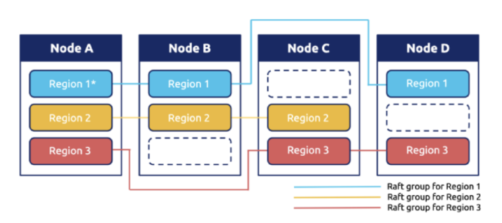
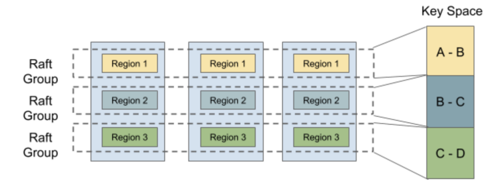

# 项目3 多Raft KV

在项目2中，你已经构建了一个基于 Raft 的高可用键值服务器，干得好！但还不够，这样的键值服务器由单个 Raft 组支持，不能无限扩展，而且每个写请求都会等待提交后再逐个写入 badger，这是确保一致性的关键要求，但也扼杀了任何并发性。



在本项目中，你将实现一个带有均衡调度器的多 Raft 键值服务器，它由多个 Raft 组组成，每个 Raft 组负责一个单独的键范围，这里称为 Region，布局如上图所示。对单个 Region 的请求像以前一样处理，但多个 Region 可以并发处理请求，这提高了性能，但也带来了一些新挑战，如将请求均衡到每个 Region 等。

本项目有3个部分：

1. 为 Raft 算法实现成员变更和领导权转移
2. 在 raftstore 上实现配置变更和 Region 分裂
3. 引入调度器

## Part A

在这部分，你将为基本 Raft 算法实现成员变更和领导权转移，这些功能是后面两部分所需的。成员变更，即配置变更，用于向 Raft 组添加或移除对等节点，这可以改变 Raft 组的法定人数，所以要小心。领导权转移，即领导者转移，用于将领导权转移给另一个对等节点，这对于负载均衡非常有用。

### 代码结构

你需要修改的代码都在 `raft/raft.go` 和 `raft/rawnode.go` 中，另外查看 `proto/proto/eraft.proto` 了解你需要处理的新消息。配置变更和领导者转移都是由上层应用触发的，所以你可能想从 `raft/rawnode.go` 开始。

### 实现领导者转移

要实现领导者转移，让我们介绍两种新的消息类型：`MsgTransferLeader` 和 `MsgTimeoutNow`。要转移领导权，你需要首先在当前领导者上用 `MsgTransferLeader` 消息调用 `raft.Raft.Step`，为了确保转移成功，当前领导者应该首先检查被转移者（即转移目标）的资格，如：被转移者的日志是否最新等。如果被转移者不合格，当前领导者可以选择中止转移或帮助被转移者，既然中止没有帮助，让我们选择帮助被转移者。如果被转移者的日志不是最新的，当前领导者应该向被转移者发送 `MsgAppend` 消息，并停止接受新的提议，以防我们最终陷入循环。所以如果被转移者合格（或在当前领导者帮助后），领导者应该立即向被转移者发送 `MsgTimeoutNow` 消息，在收到 `MsgTimeoutNow` 消息后，被转移者应该立即开始新的选举，而不管其选举超时，凭借更高的任期和最新的日志，被转移者有很大机会让当前领导者下台并成为新领导者。

### 实现配置变更

你将在这里实现的配置变更算法不是扩展 Raft 论文中提到的可以一次添加和/或移除任意对等节点的联合共识算法，相反，它只能一次添加或移除一个对等节点，这更简单且更容易理解。此外，配置变更从调用领导者的 `raft.RawNode.ProposeConfChange` 开始，它将提议一个 `pb.Entry.EntryType` 设置为 `EntryConfChange` 且 `pb.Entry.Data` 设置为输入的 `pb.ConfChange` 的条目。当类型为 `EntryConfChange` 的条目被提交时，你必须使用条目中的 `pb.ConfChange` 通过 `RawNode.ApplyConfChange` 应用它，只有这样你才能根据 `pb.ConfChange` 通过 `raft.Raft.addNode` 和 `raft.Raft.removeNode` 向这个 Raft 节点添加或移除对等节点。

> 提示：
>
> - `MsgTransferLeader` 消息是本地消息，不来自网络
> - 你将 `MsgTransferLeader` 消息的 `Message.from` 设置为被转移者（即转移目标）
> - 要立即开始新选举，你可以用 `MsgHup` 消息调用 `Raft.Step`
> - 调用 `pb.ConfChange.Marshal` 获取 `pb.ConfChange` 的字节表示并将其放入 `pb.Entry.Data`

## Part B

既然 Raft 模块支持成员变更和领导权变更了，在这部分你需要基于 Part A 让 TinyKV 支持这些 admin 命令。正如你在 `proto/proto/raft_cmdpb.proto` 中看到的，有四种类型的 admin 命令：

- CompactLog（已在项目2 Part C 中实现）
- TransferLeader
- ChangePeer
- Split

`TransferLeader` 和 `ChangePeer` 是基于 Raft 支持的领导权变更和成员变更的命令。这些将作为均衡调度器的基本操作步骤使用。`Split` 将一个 Region 分成两个 Region，这是多 Raft 的基础。你将逐步实现它们。

### 代码结构

所有更改都基于项目2的实现，所以你需要修改的代码都在 `kv/raftstore/peer_msg_handler.go` 和 `kv/raftstore/peer.go` 中。

### 提议领导者转移

这一步很简单。作为一个 Raft 命令，`TransferLeader` 将作为 Raft 条目提议。但 `TransferLeader` 实际上是一个不需要复制到其他对等节点的操作，所以你只需要为 `TransferLeader` 命令调用 `RawNode` 的 `TransferLeader()` 方法，而不是 `Propose()`。

### 在 raftstore 中实现配置变更

配置变更有两种不同的类型，`AddNode` 和 `RemoveNode`。顾名思义，它向 Region 添加一个 Peer 或从 Region 移除一个 Peer。要实现配置变更，你应该首先了解 `RegionEpoch` 这个术语。`RegionEpoch` 是 `metapb.Region` 元信息的一部分。当 Region 添加或移除 Peer 或分裂时，Region 的 epoch 已更改。RegionEpoch 的 `conf_ver` 在 ConfChange 期间增加，而 `version` 在分裂期间增加。它将用于在网络隔离下保证最新的 Region 信息，即一个 Region 中有两个领导者的情况。

你需要让 raftstore 支持处理配置变更命令。流程如下：

1. 通过 `ProposeConfChange` 提议配置变更 admin 命令
2. 日志提交后，更改 `RegionLocalState`，包括 `Region` 中的 `RegionEpoch` 和 `Peers`
3. 调用 `raft.RawNode` 的 `ApplyConfChange()`

> 提示：
>
> - 对于执行 `AddNode`，新添加的 Peer 将由领导者的心跳创建，查看 `storeWorker` 的 `maybeCreatePeer()`。那时，这个 Peer 是未初始化的，其 Region 的任何信息对我们都是未知的，所以我们使用 0 来初始化其 `Log Term` 和 `Index`。然后领导者会知道这个 Follower 没有数据（存在从 0 到 5 的日志间隙），它将直接向这个 Follower 发送快照。
> - 对于执行 `RemoveNode`，你应该显式调用 `destroyPeer()` 来停止 Raft 模块。销毁逻辑已为你提供。
> - 不要忘记更新 `GlobalContext` 的 `storeMeta` 中的 Region 状态
> - 测试代码多次调度同一个配置变更的命令直到配置变更被应用，所以你需要考虑如何忽略同一配置变更的重复命令。

### 在 raftstore 中实现 Region 分裂



为了支持多 Raft，系统执行数据分片，使每个 Raft 组只存储一部分数据。Hash 和 Range 常用于数据分片。TinyKV 使用 Range，主要原因是 Range 可以更好地聚合具有相同前缀的键，这对于 scan 等操作很方便。此外，在分裂方面 Range 优于 Hash。通常，它只涉及元数据修改，不需要移动数据。

``` protobuf
message Region {
 uint64 id = 1;
 // Region 键范围 [start_key, end_key)。
 bytes start_key = 2;
 bytes end_key = 3;
 RegionEpoch region_epoch = 4;
 repeated Peer peers = 5
}
```

让我们再看一下 Region 的定义，它包括两个字段 `start_key` 和 `end_key` 来指示 Region 负责的数据范围。所以分裂是支持多 Raft 的关键步骤。在开始时，只有一个 Region 的范围是 ["", "")。你可以将键空间视为一个循环，所以 ["", "") 代表整个空间。随着数据写入，分裂检查器会每隔 `cfg.SplitRegionCheckTickInterval` 检查 Region 大小，如果可能的话生成一个分裂键将 Region 切成两部分，你可以在 `kv/raftstore/runner/split_check.go` 中查看逻辑。分裂键将被包装为 `MsgSplitRegion` 并由 `onPrepareSplitRegion()` 处理。

为了确保新创建的 Region 和 Peer 的 id 是唯一的，id 由调度器分配。这也已提供，所以你不需要实现它。`onPrepareSplitRegion()` 实际上为 pd worker 调度一个任务来向调度器请求 id。然后在收到调度器的响应后生成一个分裂 admin 命令，见 `kv/raftstore/runner/scheduler_task.go` 中的 `onAskSplit()`。

所以你的任务是实现处理分裂 admin 命令的过程，就像配置变更一样。提供的框架支持多 Raft，见 `kv/raftstore/router.go`。当一个 Region 分裂成两个 Region 时，其中一个 Region 将继承分裂前的元数据，只修改其 Range 和 RegionEpoch，而另一个将创建相关的元信息。

> 提示：
>
> - 这个新创建的 Region 对应的 Peer 应该由 `createPeer()` 创建并注册到 router.regions。Region 的信息应该插入到 ctx.StoreMeta 的 `regionRanges` 中。
> - 对于网络隔离下的 Region 分裂情况，要应用的快照可能与现有 Region 的范围重叠。检查逻辑在 `kv/raftstore/peer_msg_handler.go` 的 `checkSnapshot()` 中。实现时请记住这一点并注意那种情况。
> - 使用 `engine_util.ExceedEndKey()` 与 Region 的 end key 进行比较。因为当 end key 等于 "" 时，任何键都会等于或大于 ""。
> - 还有更多错误需要考虑：`ErrRegionNotFound`、`ErrKeyNotInRegion`、`ErrEpochNotMatch`。

## Part C

正如我们上面所述，我们 kv 存储中的所有数据都被分成若干个 Region，每个 Region 包含多个副本。一个问题出现了：我们应该把每个副本放在哪里？我们如何为一个副本找到最佳位置？谁发送之前的 AddPeer 和 RemovePeer 命令？调度器承担这个责任。

为了做出明智的决策，调度器应该有一些关于整个集群的信息。它应该知道每个 Region 在哪里。它应该知道它们有多少键。它应该知道它们有多大…… 为了获取相关信息，调度器要求每个 Region 定期向调度器发送心跳请求。你可以在 `/proto/proto/schedulerpb.proto` 中找到心跳请求结构 `RegionHeartbeatRequest`。收到心跳后，调度器将更新本地 Region 信息。

同时，调度器定期检查 Region 信息以查找我们 TinyKV 集群中是否存在不平衡。例如，如果任何 Store 包含太多 Region，则应该从它移动 Region 到其他 Store。这些命令将作为相应 Region 心跳请求的响应被获取。

在这部分，你需要为调度器实现上述两个功能。按照我们的指南和框架，这不会太难。

### 代码结构

你需要修改的代码都在 `scheduler/server/cluster.go` 和 `scheduler/server/schedulers/balance_region.go` 中。如上所述，当调度器收到 Region 心跳时，它将首先更新其本地 Region 信息。然后它会检查这个 Region 是否有待处理的命令。如果有，它将作为响应发送回去。

你只需要实现 `processRegionHeartbeat` 函数，其中调度器更新本地信息；以及 balance-region 调度器的 `Schedule` 函数，其中调度器扫描 Store 并确定是否存在不平衡以及应该移动哪个 Region。

### 收集 Region 心跳

如你所见，`processRegionHeartbeat` 函数的唯一参数是一个 regionInfo。它包含关于这个心跳的发送者 Region 的信息。调度器需要做的只是更新本地 Region 记录。但它应该为每个心跳更新这些记录吗？

当然不是！有两个原因。一个是当这个 Region 没有发生变化时可以跳过更新。更重要的是调度器不能信任每个心跳。特别是，如果集群在某个部分有分区，一些节点的信息可能是错误的。

例如，一些 Region 在分裂后重新发起选举和分裂，但另一批隔离的节点仍然通过心跳向调度器发送过时的信息。所以对于一个 Region，两个节点中的任一个都可能说它是领导者，这意味着调度器不能同时信任它们两个。

哪一个更可信？调度器应该使用 `conf_ver` 和 `version` 来确定它，即 `RegionEpoch`。调度器应该首先比较两个节点的 Region version 的值。如果值相同，调度器比较配置变更 version 的值。配置变更 version 较大的节点必定有更新的信息。

简单来说，你可以按以下方式组织检查例程：

1. 检查本地存储中是否有相同 Id 的 Region。如果有且心跳的 `conf_ver` 和 `version` 至少有一个小于它的，则这个心跳 Region 是过时的

2. 如果没有，扫描所有与它重叠的 Region。心跳的 `conf_ver` 和 `version` 应该大于或等于所有这些，否则 Region 是过时的。

那么调度器如何确定是否可以跳过这次更新？我们可以列出一些简单的条件：

* 如果新的 `version` 或 `conf_ver` 大于原来的，则不能跳过

* 如果领导者改变了，则不能跳过

* 如果新的或原来的有 pending peer，则不能跳过

* 如果 ApproximateSize 改变了，则不能跳过

* ……

别担心。你不需要找到严格的充分必要条件。冗余更新不会影响正确性。

如果调度器根据这个心跳决定更新本地存储，有两件事它应该更新：Region 树和 Store 状态。你可以使用 `RaftCluster.core.PutRegion` 更新 Region 树，使用 `RaftCluster.core.UpdateStoreStatus` 更新相关 Store 的状态（如领导者数量、Region 数量、pending peer 数量……）。

### 实现 Region 均衡调度器

调度器中可以运行许多不同类型的调度器，例如 balance-region 调度器和 balance-leader 调度器。本学习材料将重点介绍 balance-region 调度器。

每个调度器应该实现 Scheduler 接口，你可以在 `/scheduler/server/schedule/scheduler.go` 中找到它。调度器将使用 `GetMinInterval` 的返回值作为默认间隔来定期运行 `Schedule` 方法。如果它返回 null（经过多次重试），调度器将使用 `GetNextInterval` 来增加间隔。通过定义 `GetNextInterval` 你可以定义间隔如何增加。如果它返回一个 operator，调度器将把这些 operator 作为相关 Region 下一次心跳的响应分发。

Scheduler 接口的核心部分是 `Schedule` 方法。该方法的返回值是 `Operator`，它包含多个步骤，如 `AddPeer` 和 `RemovePeer`。例如，`MovePeer` 可能包含 `AddPeer`、`transferLeader` 和 `RemovePeer`，这些你在前面部分已经实现了。以下图中的第一个 RaftGroup 为例。调度器尝试将 peer 从第三个 Store 移动到第四个。首先，它应该为第四个 Store `AddPeer`。然后它检查第三个是否是领导者，发现不是，所以不需要 `transferLeader`。然后它移除第三个 Store 中的 peer。

你可以使用 `scheduler/server/schedule/operator` 包中的 `CreateMovePeerOperator` 函数来创建 `MovePeer` operator。


在这部分，你唯一需要实现的函数是 `scheduler/server/schedulers/balance_region.go` 中的 `Schedule` 方法。这个调度器避免一个 Store 中有太多 Region。首先，调度器将选择所有合适的 Store。然后按它们的 Region 大小排序。然后调度器尝试从 Region 大小最大的 Store 中找到要移动的 Region。

调度器将尝试在 Store 中找到最适合移动的 Region。首先，它将尝试选择一个 pending Region，因为 pending 可能意味着磁盘过载。如果没有 pending Region，它将尝试找一个 follower Region。如果仍然选不出一个 Region，它将尝试选 leader Region。最后，它将选出要移动的 Region，或者调度器将尝试下一个 Region 大小较小的 Store，直到所有 Store 都被尝试过。

选出一个要移动的 Region 后，调度器将选择一个 Store 作为目标。实际上，调度器将选择 Region 大小最小的 Store。然后调度器将通过检查原 Store 和目标 Store 之间 Region 大小的差异来判断这次移动是否有价值。如果差异足够大，调度器应该在目标 Store 上分配一个新的 peer 并创建一个 move peer operator。

你可能已经注意到，上面的例程只是一个粗略的过程。还有很多问题：

* 哪些 Store 适合移动？

简而言之，一个合适的 Store 应该是 up 状态且 down 时间不能超过集群的 `MaxStoreDownTime`，你可以通过 `cluster.GetMaxStoreDownTime()` 获取。

* 如何选择 Region？

调度器框架提供了三种方法来获取 Region。`GetPendingRegionsWithLock`、`GetFollowersWithLock` 和 `GetLeadersWithLock`。调度器可以从它们获取相关的 Region。然后你可以选择一个随机的 Region。

* 如何判断这个操作是否有价值？

如果原 Store 和目标 Store 的 Region 大小差异太小，在我们将 Region 从原 Store 移动到目标 Store 后，调度器可能想在下次再移回来。所以我们必须确保差异必须大于 Region 近似大小的两倍，这确保移动后目标 Store 的 Region 大小仍然小于原 Store。
